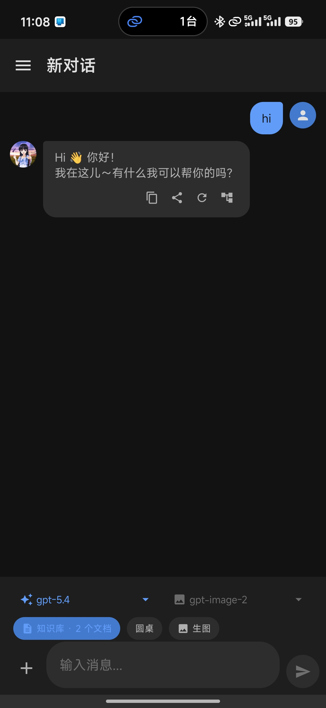
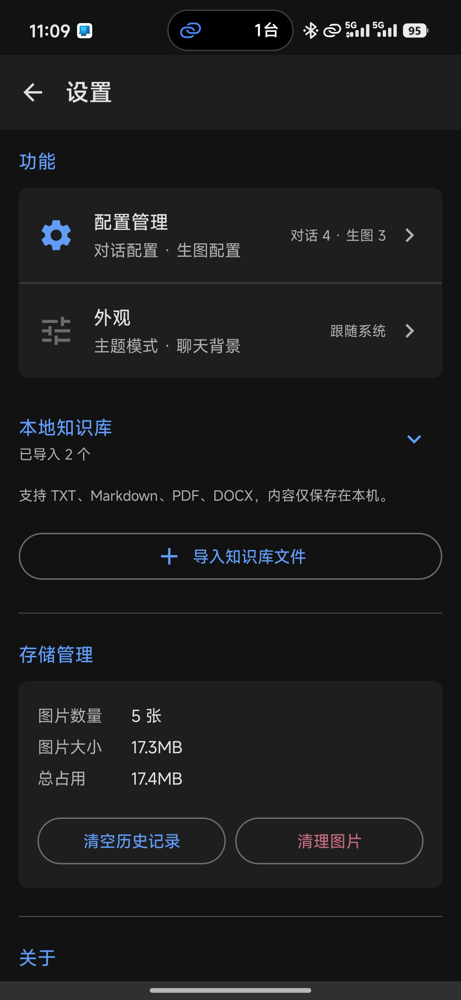
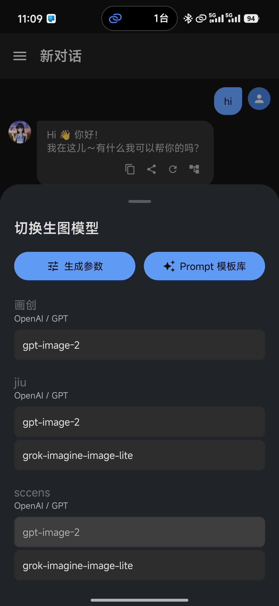

# ToChat

ToChat 是一款 Android 原生 AI 对话客户端，支持多轮文本对话、文件上下文、本地知识库和 AI 生图。应用采用类似 ChatGPT 的会话式界面，用户只需要配置 OpenAI 兼容接口，即可在本地保存会话、切换模型，并按需使用图片生成能力。

产品定位：以对话为主，生图为可选功能，适合接入自建中转、第三方 OpenAI 兼容服务、Codex/ccswitch 风格 Responses 服务，以及 OpenAI/GPT 或 Grok/xAI 生图渠道。

## 应用截图

<table>
  <tr>
    <td align="center"></td>
    <td align="center"></td>
    <td align="center"></td>
  </tr>
  <tr>
    <td align="center">应用截图 1</td>
    <td align="center">应用截图 2</td>
    <td align="center">应用截图 3</td>
  </tr>
</table>

## 核心功能

### AI 对话

- SSE 流式输出，呈现打字机式回复效果
- 多轮上下文，默认携带最近 20 条消息
- Markdown 渲染，支持代码块、加粗、列表等常见格式
- 流式请求失败时自动降级到非流式请求
- 对话历史本地持久化，支持新建、切换、删除会话
- 分支对话：可从成功的 AI 文本回复创建新分支会话，继续探索另一条上下文路径
- 多模型切换：聊天过程中可切换不同厂商、不同配置下的模型

### 文件与知识库

- 支持 PDF、Word(.docx)、TXT、Markdown(.md/.markdown) 文件附件
- 文件内容在本地提取为文本后注入对话上下文，不依赖 API 文件上传能力
- 附件文本上限 8000 字符，超出后自动截断并提示
- 本地知识库支持导入 TXT、Markdown、PDF、DOCX
- 知识库内容仅保存在本机 Room 数据库，发送消息时检索相关片段并注入模型上下文

### AI 生图

- 文生图：输入提示词生成图片
- 图生图：上传参考图并结合描述生成相似风格图片
- 支持拍照、相册选择、最近照片网格
- OpenAI/GPT 与 Grok/xAI 生图渠道独立配置
- 支持同步模式和异步轮询模式
- 显式生图模式：通过输入栏按钮或附件面板进入，避免普通聊天误触生图
- 生图模型面板提供生成参数和 Prompt 模板库入口

### 体验与界面

- 左侧抽屉式会话列表
- Prompt 模板库，支持内置模板和自定义模板
- 长按选择消息中的部分文本复制
- 生成图片支持大图预览、双指缩放、保存到相册、分享、复用参数
- 支持全局聊天背景、自定义裁剪、自动调暗和恢复默认背景
- 生图或流式对话过程中可点击停止按钮取消任务

## 配置能力

ToChat 将对话配置和生图配置分开管理，每类配置都支持添加多套服务。

### 对话配置

| 字段 | 说明 |
| --- | --- |
| 厂商名称 | 自定义显示名称，例如 OpenAI、DeepSeek、自建中转 |
| Base URL | OpenAI 兼容 API 地址 |
| API Key | 鉴权密钥，使用加密存储 |
| 接口格式 | 支持 OpenAI Chat Completions 和 OpenAI Responses |
| 聊天接口路径 | Chat Completions 默认 `v1/chat/completions`，Responses 默认 `v1/responses` |
| 模型列表 | 支持从 API 刷新，也支持手动添加自定义模型名 |

### 生图配置

| 字段 | 说明 |
| --- | --- |
| 厂商名称 | 自定义显示名称，例如 OpenAI、xAI |
| 生图渠道 | OpenAI/GPT 或 Grok/xAI |
| Base URL | 生图 API 地址 |
| API Key | 生图服务密钥 |
| 模型列表 | 例如 `dall-e-3`、`grok`，可从 API 加载或手动维护 |

## 技术栈

| 模块 | 选型 |
| --- | --- |
| 语言 | Kotlin |
| UI | Jetpack Compose + Material 3 |
| 网络 | Retrofit + OkHttp + SSE |
| 序列化 | Kotlinx Serialization |
| 图片加载 | Coil |
| 本地数据库 | Room |
| 加密存储 | EncryptedSharedPreferences + Android Keystore |
| 异步 | Kotlin Coroutines + Flow |
| 依赖注入 | Hilt |
| 架构模式 | MVVM + Repository |
| 后台任务 | Foreground Service |
| Markdown | Markwon |
| PDF 解析 | pdfbox-android |

## 项目结构

```text
app/src/main/java/com/gzzz/tochat/
├── data/
│   ├── provider/          # API 渠道实现
│   ├── repository/        # 对话、生图、历史、设置、知识库业务
│   ├── local/             # Room 数据库、Entity、DAO
│   ├── remote/            # API Service 与 DTO
│   ├── security/          # 加密存储
│   └── network/           # 网络状态监听
├── domain/model/          # 领域数据模型
├── ui/
│   ├── chat/              # 主聊天页与模型切换
│   ├── components/        # 消息气泡、输入栏等通用组件
│   ├── settings/          # 设置、配置管理、外观、知识库
│   ├── imagedetail/       # 图片详情
│   ├── session/           # 会话抽屉
│   ├── template/          # Prompt 模板库
│   └── theme/             # Material 3 主题
├── di/                    # Hilt 依赖注入
└── util/                  # 图片选择、文件解析、最近照片加载等工具
```

## 数据与安全

- API Key 和 Base URL 使用 EncryptedSharedPreferences 加密存储
- 密钥由 Android Keystore 保护
- OkHttp 日志仅记录 URL 和状态码，不记录请求体
- 错误日志不输出 API Key
- 聊天历史、知识库文档、配置元数据保存在本地 Room 数据库
- 生成图片、缩略图和输入参考图保存在本地文件系统
- 纯本地应用，当前不支持云端同步

## 构建要求

- Android Studio
- Android SDK 34
- 最低支持 Android 8.0，API 26
- JDK 与 Android Gradle Plugin 版本以项目 Gradle 配置为准

使用 Android Studio 打开项目并同步 Gradle 后构建。若本地补齐了 Gradle Wrapper 脚本，也可以使用：

```bash
./gradlew assembleDebug
```

## 已知限制

- Grok Provider 仅用于生图，不支持文本对话
- 取消流式对话可能有 1-2 秒延迟
- 分支对话当前仅支持从成功的 AI 文本回复创建
- OpenAI Responses 协议当前按非流式请求接入，尚未支持 Responses SSE 流式解析
- 不同 ccswitch/Codex 兼容服务可能需要按服务端错误体继续适配 Responses input 结构
- 当前缺少单元测试和集成测试覆盖

## 应用信息

- 包名：`com.gzzz.tochat`
- 应用名：ToChat
- 版本：`v1.0.0`
